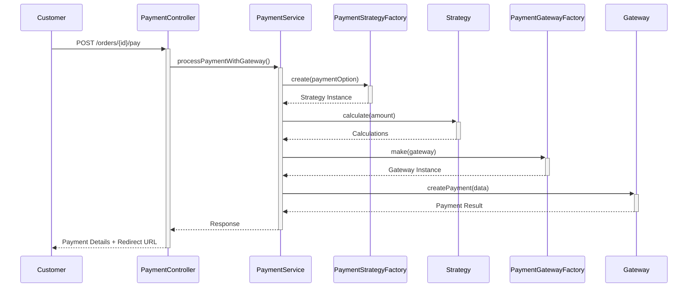
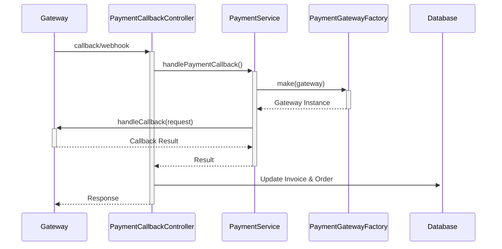

# دليل نظام الدفع الشامل - Mini Restaurant Reservation System

## 📋 فهرس المحتويات
1. [نظرة عامة على النظام](#نظرة-عامة)
2. [هيكل النظام الجديد](#هيكل-النظام)
3. [Design Patterns المطبقة](#design-patterns)
4. [بوابات الدفع المدعومة](#بوابات-الدفع)
5. [استراتيجيات الدفع](#استراتيجيات-الدفع)
6. [واجهات برمجة التطبيقات](#api-endpoints)
7. [تدفق العمليات](#تدفق-العمليات)
8. [أمثلة عملية](#أمثلة-عملية)
9. [الإعدادات والتكوين](#الإعدادات)
10. [استكشاف الأخطاء](#استكشاف-الأخطاء)

---

## 🏗️ نظرة عامة على النظام {#نظرة-عامة}

نظام الدفع الجديد مطور باستخدام **Strategy Pattern** و **Factory Pattern** لضمان المرونة والقابلية للتوسع، ويدعم ثلاث بوابات دفع رئيسية مع دعم كامل لـ InstaPay.

### **الميزات الجديدة:**
- ✅ **Factory Pattern** لإنشاء بوابات الدفع ديناميكياً
- ✅ **Strategy Pattern** لحساب الضرائب والرسوم
- ✅ **Universal Callback Handler** لجميع البوابات
- ✅ **دعم InstaPay** من Paymob للمحافظ الإلكترونية
- ✅ **HMAC Security** للحماية الأمنية
- ✅ **Payment Verification** المباشر من APIs
- ✅ **Clean Architecture** متبعة لمبادئ SOLID

### **بوابات الدفع المدعومة:**
1. **PayPal** - دفع عالمي آمن
2. **Stripe** - دفع بالبطاقات الائتمانية
3. **Paymob** - دفع محلي مصري (كارت + InstaPay)

---

## 🏛️ هيكل النظام الجديد {#هيكل-النظام}

```
Payment System (v2.0)
├── Interfaces/
│   ├── PaymentGatewayInterface.php (موحد لجميع البوابات)
│   └── PaymentStrategyInterface.php (للحسابات)
├── Factories/
│   └── PaymentGatewayFactory.php (Factory Pattern)
├── Services/
│   ├── PaymentService.php (محدث بـ Factory Pattern)
│   ├── PaymentGateways/
│   │   ├── StripeGateway.php (محدث)
│   │   ├── PayPalGateway.php (محدث)
│   │   └── PaymobGateway.php (محدث مع InstaPay)
│   └── PaymentStrategies/
│       ├── FullServiceStrategy.php (14% + 20%)
│       ├── ServiceOnlyStrategy.php (15%)
│       └── PaymentStrategyFactory.php
├── Controllers/
│   ├── PaymentController.php (محدث)
│   └── PaymentCallbackController.php (جديد)
└── Config/
    ├── services.php (محدث بإعدادات البوابات)
    └── .env.example (متغيرات البيئة)
```

---

## 🎯 Design Patterns المطبقة {#design-patterns}

### 1. **Factory Pattern**
```php
// إنشاء بوابة الدفع المناسبة ديناميكياً
$gateway = PaymentGatewayFactory::make('stripe'); // أو 'paypal' أو 'paymob'
$result = $gateway->createPayment($data);
```

### 2. **Strategy Pattern**
```php
// اختيار استراتيجية الحساب
$strategy = PaymentStrategyFactory::create(1); // Full Service
$calculations = $strategy->calculate($amount);
```

### 3. **Interface Segregation**
```php
interface PaymentGatewayInterface {
    public function createPayment(array $data): array;
    public function handleCallback(Request $request): array;
    public function verifyPayment(string $transactionId): array;
}
```

---

## 💳 بوابات الدفع المدعومة {#بوابات-الدفع}

### 1. **Stripe Gateway**
- **النوع**: Inline/Card payment
- **العملات المدعومة**: USD, EUR, GBP
- **الميزات**: 3D Secure, Webhooks, Real-time verification

```php
// مثال استخدام Stripe
$stripeGateway = new StripeGateway();
$result = $stripeGateway->createPayment([
    'amount' => 100.00,
    'currency' => 'usd',
    'description' => 'Restaurant Order Payment'
]);
```

### 2. **PayPal Gateway**
- **النوع**: Redirect payment
- **العملات المدعومة**: USD, EUR, GBP
- **الميزات**: PayPal Checkout, Express Checkout

```php
// مثال استخدام PayPal
$paypalGateway = new PayPalGateway();
$result = $paypalGateway->createPayment([
    'amount' => 100.00,
    'currency' => 'USD',
    'return_url' => 'https://yoursite.com/success',
    'cancel_url' => 'https://yoursite.com/cancel'
]);
```

### 3. **Paymob Gateway (مع دعم InstaPay)**
- **النوع**: iFrame/Redirect + Mobile Wallet
- **العملة المدعومة**: EGP
- **الميزات**: بطاقات محلية، InstaPay، محافظ إلكترونية

```php
// مثال استخدام Paymob للكارت
$paymobGateway = new PaymobGateway();
$result = $paymobGateway->createPayment([
    'amount' => 100.00,
    'currency' => 'EGP',
    'payment_method' => 'card'
]);

// مثال استخدام InstaPay
$result = $paymobGateway->createPayment([
    'amount' => 100.00,
    'currency' => 'EGP',
    'payment_method' => 'instapay',
    'mobile_number' => '+201234567890'
]);
```

---

## 📊 استراتيجيات الدفع {#استراتيجيات-الدفع}

### Option 1: Full Service Package
- **الضرائب**: 14%
- **رسوم الخدمة**: 20%
- **إجمالي الإضافات**: 34%

### Option 2: Service Only
- **الضرائب**: 0%
- **رسوم الخدمة**: 15%
- **إجمالي الإضافات**: 15%

```php
// مثال حساب Option 1
$strategy = new FullServiceStrategy();
$result = $strategy->calculate(100); // 100 LE base amount

// النتيجة:
// tax_amount: 14.00
// service_charge_amount: 20.00
// final_amount: 134.00
```

---

## 🔗 واجهات برمجة التطبيقات {#api-endpoints}

### **Protected Endpoints (تحتاج تسجيل دخول)**

#### معلومات الدفع
```http
GET /api/v1/payment-methods
GET /api/v1/payment-gateways
```

#### معالجة الدفع
```http
POST /api/v1/orders/{orderId}/pay
Content-Type: application/json

{
    "payment_option": 1,
    "payment_gateway": "stripe",
    "payment_data": {
        "currency": "usd"
    }
}
```

#### حالة الدفع والفواتير
```http
GET /api/v1/orders/{orderId}/payment-status
GET /api/v1/invoices/{invoiceId}
GET /api/v1/payment/{gateway}/verify/{transactionId}
```

### **Public Endpoints (للخدمات الخارجية)**

#### Universal Callback Handler
```http
POST /api/payment/{gateway}/callback
```

#### PayPal Specific
```http
GET /api/payment/paypal/success?paymentId=xxx&PayerID=yyy
GET /api/payment/paypal/cancel?paymentId=xxx
```

#### Webhooks
```http
POST /api/webhooks/stripe
POST /api/webhooks/paymob
```

---

## 🔄 تدفق العمليات {#تدفق-العمليات}

### 1. **بداية الدفع**


### 2. **إكمال الدفع**


---

## 💡 أمثلة عملية {#أمثلة-عملية}

### **مثال 1: دفع بـ Stripe**
```bash
# 1. بداية الدفع
curl -X POST "http://localhost:8000/api/v1/orders/123/pay" \
-H "Authorization: Bearer YOUR_TOKEN" \
-H "Content-Type: application/json" \
-d '{
    "payment_option": 1,
    "payment_gateway": "stripe",
    "payment_data": {
        "currency": "usd"
    }
}'

# الاستجابة
{
    "status": 201,
    "message": "Payment processed successfully",
    "data": {
        "invoice": { ... },
        "payment_result": {
            "success": true,
            "transaction_id": "pi_1234567890",
            "client_secret": "pi_1234567890_secret_ABC123",
            "requires_action": false
        }
    }
}
```

### **مثال 2: دفع بـ PayPal**
```bash
curl -X POST "http://localhost:8000/api/v1/orders/123/pay" \
-H "Authorization: Bearer YOUR_TOKEN" \
-H "Content-Type: application/json" \
-d '{
    "payment_option": 2,
    "payment_gateway": "paypal",
    "payment_data": {
        "currency": "USD"
    }
}'

# الاستجابة
{
    "status": 201,
    "message": "Payment processed successfully",
    "data": {
        "invoice": { ... },
        "payment_result": {
            "success": true,
            "transaction_id": "PAY-123456789",
            "approval_url": "https://www.paypal.com/checkoutnow?token=EC-123",
            "redirect_required": true
        },
        "next_action": {
            "type": "redirect",
            "url": "https://www.paypal.com/checkoutnow?token=EC-123"
        }
    }
}
```

### **مثال 3: دفع بـ InstaPay**
```bash
curl -X POST "http://localhost:8000/api/v1/orders/123/pay" \
-H "Authorization: Bearer YOUR_TOKEN" \
-H "Content-Type: application/json" \
-d '{
    "payment_option": 1,
    "payment_gateway": "paymob",
    "payment_data": {
        "payment_method": "instapay",
        "mobile_number": "+201234567890",
        "currency": "EGP"
    }
}'

# الاستجابة
{
    "status": 201,
    "message": "Payment processed successfully",
    "data": {
        "invoice": { ... },
        "payment_result": {
            "success": true,
            "transaction_id": "12345",
            "payment_key": "ZXlKaGJHY2lPaUo...",
            "instapay_url": "https://accept.paymob.com/api/acceptance/payments/pay?...",
            "redirect_required": true
        },
        "instapay_data": {
            "mobile_number": "+201234567890",
            "instapay_url": "https://accept.paymob.com/api/acceptance/payments/pay?..."
        }
    }
}
```

---

## ⚙️ الإعدادات والتكوين {#الإعدادات}

### **متغيرات البيئة (.env)**
```env
# PayPal Configuration
PAYPAL_MODE=sandbox
PAYPAL_CLIENT_ID=your_paypal_client_id
PAYPAL_CLIENT_SECRET=your_paypal_client_secret

# Stripe Configuration
STRIPE_PUBLIC_KEY=pk_test_your_stripe_public_key
STRIPE_SECRET_KEY=sk_test_your_stripe_secret_key
STRIPE_WEBHOOK_SECRET=whsec_your_webhook_secret

# Paymob Configuration
PAYMOB_API_KEY=your_paymob_api_key
PAYMOB_INTEGRATION_ID=your_integration_id
PAYMOB_IFRAME_ID=your_iframe_id
PAYMOB_INSTAPAY_INTEGRATION_ID=your_instapay_integration_id
PAYMOB_HMAC_SECRET=your_hmac_secret
```

### **إعدادات الخدمات (config/services.php)**
```php
'paypal' => [
    'mode' => env('PAYPAL_MODE', 'sandbox'),
    'client_id' => env('PAYPAL_CLIENT_ID'),
    'client_secret' => env('PAYPAL_CLIENT_SECRET'),
    // ...
],

'stripe' => [
    'public' => env('STRIPE_PUBLIC_KEY'),
    'secret' => env('STRIPE_SECRET_KEY'),
    'webhook_secret' => env('STRIPE_WEBHOOK_SECRET'),
    // ...
],

'paymob' => [
    'api_key' => env('PAYMOB_API_KEY'),
    'integration_id' => env('PAYMOB_INTEGRATION_ID'),
    'instapay_integration_id' => env('PAYMOB_INSTAPAY_INTEGRATION_ID'),
    // ...
]
```

---

## 🔍 استكشاف الأخطاء {#استكشاف-الأخطاء}

### **أخطاء شائعة وحلولها**

#### 1. **خطأ في Factory Pattern**
```php
// خطأ: InvalidArgumentException: Unsupported payment gateway
// الحل: التأكد من اسم البوابة الصحيح
$gateway = PaymentGatewayFactory::make('stripe'); // صحيح
$gateway = PaymentGatewayFactory::make('Stripe'); // خطأ
```

#### 2. **خطأ في إعدادات البوابة**
```bash
# خطأ: Failed to get authentication token from Paymob
# الحل: التحقق من متغيرات البيئة
php artisan config:clear
php artisan cache:clear
```

#### 3. **خطأ في HMAC Verification**
```php
// خطأ: Invalid HMAC signature
// الحل: التأكد من HMAC Secret الصحيح في Paymob
Log::info('HMAC verification failed', ['received_hmac' => $hmac]);
```

### **نصائح للتطوير**

1. **استخدم Logs للمتابعة**
```php
Log::info('Payment processed', [
    'gateway' => $gateway,
    'transaction_id' => $transactionId,
    'amount' => $amount
]);
```

2. **اختبر البوابات في Sandbox Mode**
3. **تأكد من إعداد Webhooks بشكل صحيح**
4. **استخدم Payment Verification للتأكد من الدفع**

---

## 🚀 إضافة بوابة دفع جديدة

```php
// 1. إنشاء كلاس جديد
class NewGateway implements PaymentGatewayInterface
{
    public function createPayment(array $data): array { /* ... */ }
    public function handleCallback(Request $request): array { /* ... */ }
    public function verifyPayment(string $transactionId): array { /* ... */ }
    public function validatePaymentData(array $paymentData): bool { /* ... */ }
    public function getGatewayName(): string { return 'newgateway'; }
}

// 2. تحديث Factory
public static function make(string $gatewayName): PaymentGatewayInterface
{
    return match (strtolower($gatewayName)) {
        'stripe' => new StripeGateway(),
        'paypal' => new PayPalGateway(),
        'paymob' => new PaymobGateway(),
        'newgateway' => new NewGateway(), // إضافة البوابة الجديدة
        default => throw new InvalidArgumentException("Unsupported payment gateway: {$gatewayName}")
    };
}
```

---

## 📞 الدعم والمساعدة

للاستفسارات والدعم، يرجى التواصل مع: **hr@appssquare.com**

---

*آخر تحديث: سبتمبر 2025 | إصدار النظام: 2.0*
